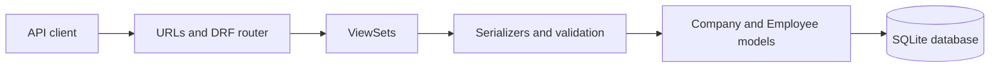

# Company API — Django REST Framework

A simple REST API to manage **Companies** and their **Employees**, built while learning
[Django REST Framework (DRF)](https://www.django-rest-framework.org/) for the first time.

> My first hands-on DRF project — the goal was to understand how to turn Django models
> into a working REST API with clean, browsable endpoints.

---

## Features

- CRUD APIs for **Company** and **Employee** resources
- A **Company → Employee** relationship (one company has many employees)
- A custom nested endpoint to list all employees of a specific company
- Automatic URL routing using DRF's `DefaultRouter`
- Model-based permissions (read-only for anonymous users)

---

## Tech Stack

- Python
- Django 6
- Django REST Framework
- SQLite (development database)

---

## API Endpoints

Base URL: `/api/v1/`

| Method            | Endpoint                          | Description                          |
|-------------------|-----------------------------------|--------------------------------------|
| GET / POST        | `/api/v1/companies/`              | List all companies / create one      |
| GET / PUT / DELETE| `/api/v1/companies/{id}/`         | Retrieve / update / delete a company |
| GET               | `/api/v1/companies/{id}/employees/` | List employees of a company        |
| GET / POST        | `/api/v1/employees/`              | List all employees / create one      |
| GET / PUT / DELETE| `/api/v1/employees/{id}/`         | Retrieve / update / delete employee  |

---

## Getting Started

```bash
# 1. Clone the repo
git clone https://github.com/Prem7105/company-api-drf.git
cd company-api-drf

# 2. (Recommended) create a virtual environment
python -m venv .venv
.venv\Scripts\activate        # Windows

# 3. Install dependencies
pip install django djangorestframework

# 4. Apply database migrations
python manage.py migrate

# 5. (Optional) create an admin user
python manage.py createsuperuser

# 6. Run the server
python manage.py runserver
```

Then open **http://127.0.0.1:8000/api/v1/companies/** in your browser.

---

## What I Learned (first DRF project)

- **Serializers** — how to convert Django model instances to/from JSON using
  `ModelSerializer` / `HyperlinkedModelSerializer`.
- **ViewSets** — how `ModelViewSet` gives you full CRUD (list, create, retrieve,
  update, delete) with very little code.
- **Routers** — how `DefaultRouter` automatically generates all the URL patterns
  for a ViewSet, instead of writing each `path()` by hand.
- **Custom actions** — how to add an extra endpoint with the `@action` decorator
  (used for `companies/{id}/employees/`).
- **Model relationships in an API** — connecting Employee to Company with a
  `ForeignKey` and exposing that relationship over REST.
- **The browsable API** — how DRF gives a web UI to test endpoints without Postman.
- **Permissions basics** — allowing read-only access for anonymous users.

## Next Steps (things I want to improve)

- Move `SECRET_KEY` and settings into environment variables (`.env`).
- Add token / JWT authentication.
- Add pagination, filtering, and validation.
- Write tests and add a `requirements.txt`.

---

## Architecture

Requests enter through Django URL routing and DRF's router, then pass through viewsets and serializers to the company and employee models. The development setup uses SQLite.


